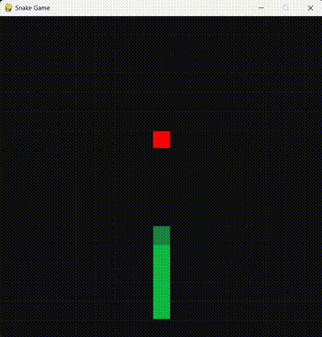

# AI Snake model for Pathfinding

The traditional snake and apple game is now implemented using the power of AI. Using the **Breadth-First Search (BFS) algorithm** to enable the snake to find the shortest path to the apple.


## Table of Contents

- [Technologies Used](#technologies-used)
- [Gallery](#gallery)
- [Setup and Execution](#setup-and-execution)
- [Code Overview](#code-overview)
- [Functionality](#functionality)
- [License](#license)

## Technologies Used

- [Python3](https://www.python.org)
- [Pygame (module)](https://www.pygame.org/)
- [random (module)](https://docs.python.org/3/library/random.html)

## Gallery



## Setup and Execution

1. Download and install [Python 3](https://www.python.org).
2. Install the **pygame** module by executing the following command in your terminal inside the project folder:
```bash
pip install pygame
```
3. Run `play.py` to start the game.

## Code Overview

- `settings.py` : This file contains the game configurations (including snake and window styling) and global variables such as width and height.
- `snake.py` : This file contains the traversal logic using BFS algorithm and funcitons to find adjacent squares.
- `play.py` : Contains the code required to run the game.

## Functionality

1. The snake uses the BFS algorithm to find the shortest path (path 1) to the apple. If path 1 is not accessible, the process moves to step 4.
2. A virtual snake, identical to the actual one, is created and set to follow path 1.
3. Once the virtual snake reaches the apple, the path between its head and tail (path 2) is checked. If accessible, the actual snake is then directed to follow path 1.
4. If either path 1 or path 2 is inaccessible, the actual snake is commanded to follow its tail.

For more details, please read the comments in the `.py` files.


## License

This project is licensed under the MIT License - see the [LICENSE.md](LICENSE.md) file for more details.
